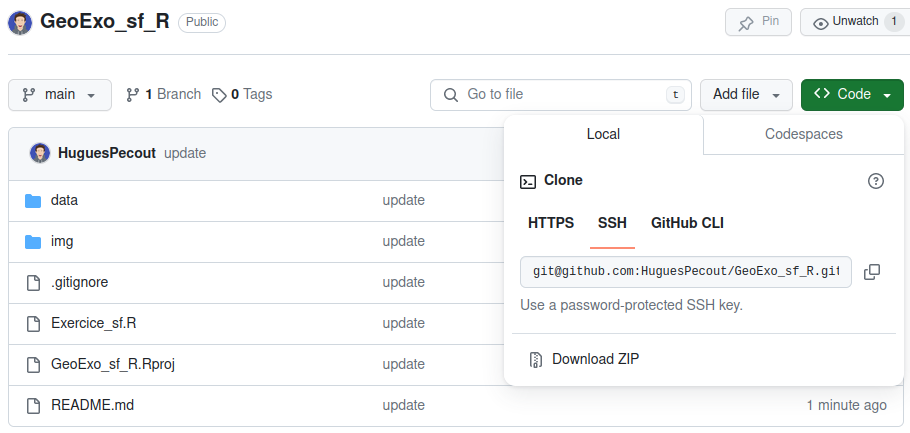
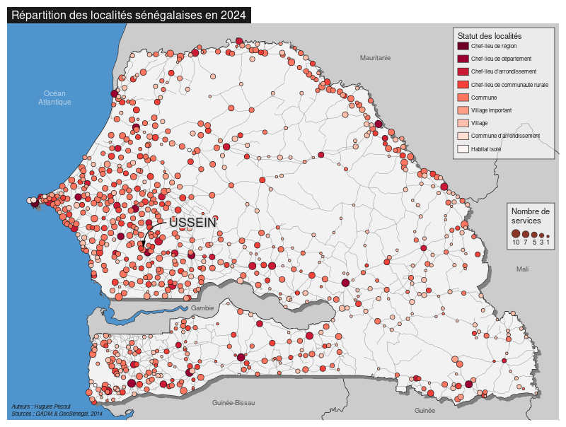
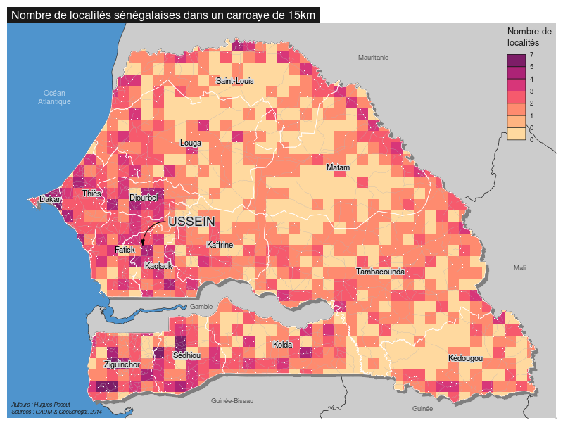

# Geomatique avec R - Exercice appliqué 

### Master Géomatique - Université du Sine Saloum El-Hâdj Ibrahima NIASS

*Hugues Pecout (CNRS, UMR Géographie-Cités)*

 

#### **A. Téléchargement de l'espace de travail**

Un projet Rstudio est téléchargeable à ce lien : [**https://github.com/RCura/GeoExo_sf_R**](https://github.com/RCura/GeoExo_sf_R)

Téléchargez le dépôt zippé ("*Download ZIP*") **GeoExo_sf_R** sur votre machine.   

 

Une fois le dossier dé-zippé, lancez le projet Rstudio en double-cliquant sur le fichier **GeoExo_sf_R.Rproj**.

 

#### **B. Les données à disposition**

Le fichier de données est mis à disposition dans le répertoire **data**.

**Le fichier GeoPackage** (**GeoSenegal.gpkg**) contient 7 couches géographiques :

- **Pays_voisins** : Couche des frontières du Sénégal et de l'ensemble de ses pays limitrophes. Source : https://gadm.org/, 2014   
- **Senegal** : Couche des frontières du Sénégal. Source : https://gadm.org/, 2014   
- **Regions** : Couche des régions sénégalaises. Source : https://gadm.org/, 2014   
- **Departements** : Couche des départements sénégalais. Source : https://gadm.org/, 2014   
- **Localites** : Couche de points des localités sénégalaises. Source : Base de données géospatiales prioritaires du Sénégal. https://www.geosenegal.gouv.sn/, 2014. 
- **USSEIN** : Localisation de l'Université du Sine Saloum El-hâdj ibrahima NIASS. Source : Google Maps, 2014. 
- **Routes** : Couche du réseau routier sénégalais. Source : Base de données géospatiales prioritaires du Sénégal. https://www.geosenegal.gouv.sn/, 2014. 

 

## **EXERCICE**

#### **En vous appuyant sur les manuels [Geomatique avec R](https://rcarto.github.io/geomatique_avec_r/) et [Cartographie avec R](https://rcarto.github.io/cartographie_avec_r/), effectuez les opérations suivantes dans le fichier Exercice_sf.R :**

 

#### A. Import des données

Importer l'ensemble des couches géographiques contenues dans le fichier GeoPackage **GeoSenegal.gpkg**.

    st_layers("data/GeoSenegal.gpkg")
*
    ... <- st_read(dsn = "data/GeoSenegal.gpkg", layer = "...")

 

#### B. Sélection et intersection spatiale

##### B.1 Sélectionner (par attribut ou par localisation) uniquement les localités du Sénégal.

    # Solution 1 - par attribut
    ... <- ...[...$PAYS == "...", ]
    
    # Solution 2 - par localisation
    ... <- st_filter(x = ..., y = ..., .predicate = st_intersects)
    
 

##### B.2 Calculer le nombre de services présents dans chaque localité. 
Assigner le résultat dans une nouvelle colonne de la couche géographique des localités sénégalaises.

    ...$... <- rowSums(...[, 5:17, drop=TRUE])
    

 

##### B.3 Découper le réseau routier en fonction des limites du Sénégal.

    ... <- st_intersection(x = ..., y = ...)

 

#### C. Carte thématique des localités

Construisez une carte thématique représentant les localités sénégalaises par leur nombre de services qu'elles abritent (symboles proportionnels) et par leur statut ("TYPELOCAL") représenter en couleur dans les symboles proportionnels. 

Exemple :

 
    
Pour vous aider, voici les étiquettes des différentes modalités (cf. métadonnées) :  

- 1 = Chef-lieu de région    
- 2 = Chef-lieu de département   
- 3 = Chef-lieu arrondissement   
- 4 = Chef-lieu de communauté rurale   
- 5 = Commune   
- 6 = Village important   
- 7 = Village  
- 8 = Commune arrondissement   
- 9 = Habitat isolé   

 

      val = c("Chef-lieu de région", 
              "Chef-lieu de département", 
              "Chef-lieu d'arrondissement",
              "Chef-lieu de communauté rurale", 
              "Commune", 
              "Village important", 
              "Village",
              "Commune d'arrondissement", 
              "Habitat isolé")

 

#### D. Nombre d'écoles dans un rayon de 50km ?

Calculer le nombre de localités qui abrite au moins une école (attribut "SERV_ECOLE" dans la couche géographique des localités) dans un rayon de 50km (distance euclidienne) autour de l'Université du Sine Saloum El-hâdj ibrahima NIASS (USSEIN).

 

##### D.1. Calculer un buffer de 50 km autour d'USSEIN

    ... <- st_buffer(USSEIN, ...)
    
 

##### D.2. Sélectionner les localités situées dans la zone tampon de 50km

    inters_loc_buff <- st_intersection(..., ...)

    
    
##### D.3 Combien de ces localités abritent au moins une école ?    
    
    ... <- sum(inters_loc_buff$...)
    

 

#### E. Utilisation d'un maillage régulier

##### E.1 Créer un maillage régulier de carreaux de 50km de côté sur l'ensemble du Sénégal

    grid <- st_make_grid(..., cellsize = ..., square = ...).
    
    # Transformer la grille en objet sf avec st_sf()
    grid <- st_sf(geometry = grid)
    
    # Ajouter un identifiant unique à chaque carreaux
    grid$id<- 1:nrow(grid)

 

##### E.2 Récuperer le carreau d'appartenance (id) de chaque localité.

    grid_loc <- st_intersects(..., ..., sparse = TRUE)
    
 

##### E.3 Compter le nombre de localités dans chacun des carreaux.

    grid_loc <- grid_loc %>%
      group_by(...) %>%
      summarise(n_loc = ...)
    
    

##### E.4 Découper la grille en fonction des limites du sénégal (optionel)

    grid_sen <- st_intersection(..., ...)
    

 

#### F. Enregistrer la grille régulière découpée par les limites de Sénégal dans le fichier **GeoSenegal.gpkg**

    st_write(obj = ..., dsn = "data/GeoSenegal.gpkg", layer = "...")

 

#### G. Construire une carte représentant le nombre de localités par carreau.

Exemple : 

Quelles critiques pouvez-vous faire de cette carte thématique ? Les règles de sémiologie graphique sont-elles respectées ?

